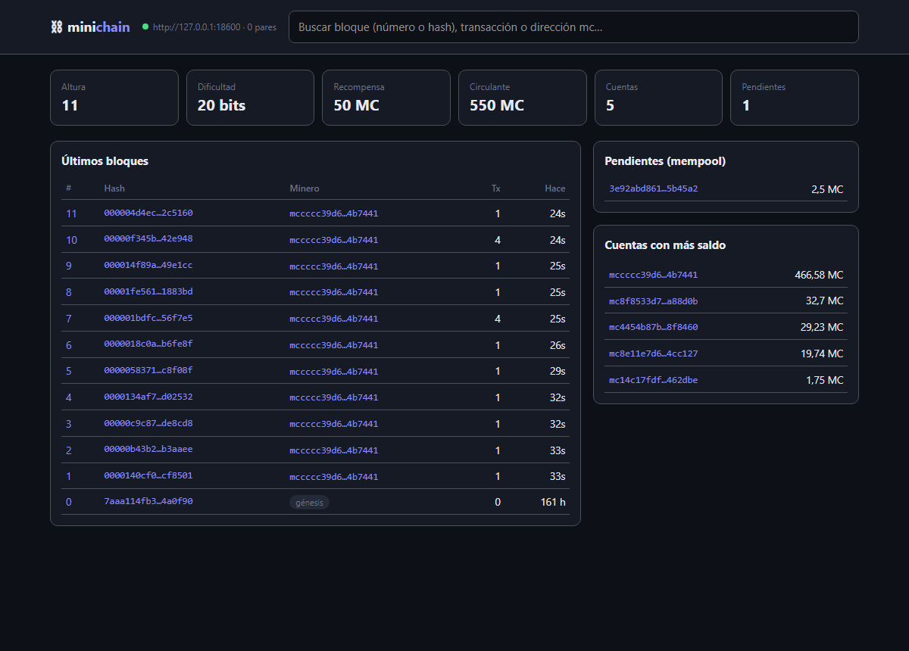
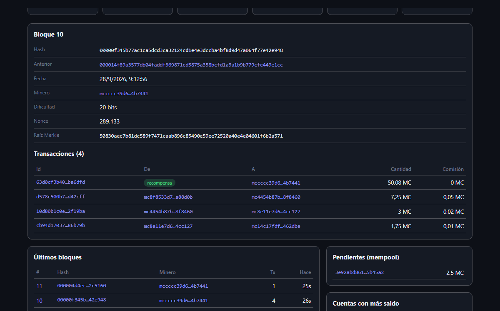

# minichain ⛓

Una blockchain completa escrita desde cero en Python, con los mismos mecanismos que
Bitcoin/Ethereum pero en ~900 líneas legibles y comentadas en español.



<details><summary>Detalle de un bloque</summary>


</details>

| Pieza | Cómo funciona aquí |
|---|---|
| **Carteras** | Claves Ed25519. Dirección = `mc` + 40 hex del SHA-256 de la clave pública. |
| **Transacciones** | Modelo de cuentas (como Ethereum). Firmadas; el *nonce* por cuenta impide repetirlas. Cantidades en enteros (1 MC = 10⁸ unidades). |
| **Bloques** | Cabecera con raíz Merkle de las transacciones. La 1ª transacción es la recompensa del minero (coinbase) = subsidio + comisiones. |
| **Minado** | Prueba de trabajo SHA-256 con dificultad en bits. Se reajusta cada N bloques hacia el tiempo objetivo. Halving de la recompensa. |
| **Consenso** | Gana la cadena válida con **más trabajo acumulado**. En una reorganización, las transacciones de bloques huérfanos vuelven a la mempool. |
| **Madurez** | Las recompensas de minado no se pueden gastar hasta pasados N bloques (evita gastar monedas que desaparecen en una reorganización). |
| **Red** | Nodos HTTP que propagan transacciones y bloques (gossip), se descubren entre sí y se sincronizan. |
| **Explorador** | Página web servida por cada nodo: bloques en vivo, buscador, cuentas, transacciones. Modo claro/oscuro, móvil. |

## Instalar

```bash
uv tool install --editable D:\Herramientas\minichain
```

## Empezar en 1 minuto

```bash
minichain demo --abrir          # 3 nodos, 2 mineros, transferencias; abre el explorador
```

## Uso real

```bash
minichain cartera nueva yo
minichain cartera nueva amigo
minichain nodo --minar yo --abrir                 # red principal, bloque cada ~10 s
# en otra terminal:
minichain saldo yo --historial
minichain enviar yo amigo 12.5 --comision 0.01 --esperar
```

Redes: `--red principal` (defecto, ~10 s por bloque, madurez 20) o `--red pruebas` (~3 s, madurez 5).
Todos los nodos de una red deben usar la misma.

### Varios PCs en tu red local

```bash
# PC A (IP 192.168.1.20)
minichain nodo --host 0.0.0.0 --publico http://192.168.1.20:8545 --minar yo
# PC B
minichain nodo --host 0.0.0.0 --publico http://192.168.1.30:8545 --pares http://192.168.1.20:8545 --minar otro
```

(Windows pedirá permiso en el firewall la primera vez.)

## API HTTP

| Método | Ruta | |
|---|---|---|
| GET | `/api/estado` | altura, dificultad, trabajo, pares, mempool |
| GET | `/api/bloques?n=20&hasta=H` | últimos bloques (sin transacciones) |
| GET | `/api/bloque/{altura o hash}` | bloque completo |
| GET | `/api/tx/{id}` | transacción (confirmada o pendiente) |
| GET | `/api/cuenta/{dirección}` | saldo, parte inmadura, nonce, historial |
| GET | `/api/mempool`, `/api/ricos`, `/api/cadena` | |
| POST | `/api/tx` | enviar transacción firmada |
| POST | `/api/bloque` | anunciar bloque |
| POST | `/api/pares` | `{"url": …}` presentarse a un nodo |

## Seguridad: qué está cubierto y qué no

Probado con tests: firmas falsificadas, robo con otra clave, doble gasto, repetición de
transacciones, recompensas infladas, trabajo insuficiente, marcas de tiempo futuras,
transacciones alteradas dentro de un bloque (Merkle), cadenas inválidas y reorganizaciones.

**No** es para dinero real: las carteras se guardan sin cifrar en `~/.minichain`, la red no
tiene protección anti-spam/DoS ni cifrado, y descargar la cadena entera en cada bifurcación
no escala a millones de bloques.

## Tests

```bash
uv run pytest        # 22 tests, incluida una red real de 2 nodos
```
